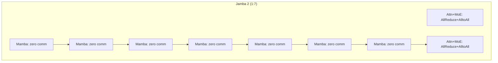
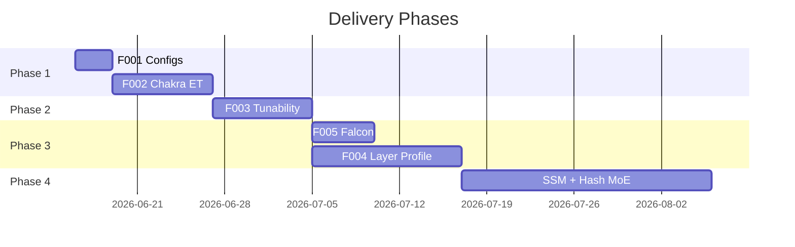

# AICB Workload Generator
# 模型可扩展性

功能设计说明书 & 竞争分析报告

<div class="pt-12">
  <span class="text-neutral-400">2026-06-15 | 25 cited sources</span>
</div>

---
layout: two-cols
---

# 研究问题

<v-clicks>

1. AICB 框架能否扩展到 **LLaMA, GPT, Mistral, Qwen, Gemma, Falcon, DBRX** 等模型架构？
2. 2025-2026 年是否有新的 LLM 模型发布，引入了**新的并行策略**或通信 collective？
3. aliyun/aicb GitHub 仓库是否有**近期更新**或**社区贡献**支持新模型？
4. 与其他 benchmark 工具（**PARAM, Chakra, astra-sim**）相比，AICB 的**模型覆盖**有何差距？

</v-clicks>

::right::

<div class="pl-8 pt-16">

```yaml
AICB 2.1 (November 2025):
  supported_models: ~10
  frameworks:
    - Megatron-LM
    - DeepSpeed
    - DeepSeek
    - vLLM (inference)
  output_format:
    - SimAI proprietary
  mocked_model:
    - linear
    - attention
    - MLP
    - embeddings
```

</div>

---
layout: image-right
image: /dev/null
---

# Finding #1
# Most extensions are parametric

<div class="text-2xl font-bold text-teal-500 mb-4">
  80%+ of new models can be added via config files only
</div>

<v-clicks>

- All decoder-only transformers share the same layer primitives
- Differences are **parametric**: layer count, hidden dim, GQA ratio, activation function
- AICB's `mocked_model` already has config fields for all these parameters
- Only 3 model families need code changes: **Falcon**, **DBRX**, **Jamba**

</v-clicks>

---
layout: two-cols
---

# Model Architecture Landscape

| Model Family | AICB Fit | Effort |
|-------------|----------|--------|
| LLaMA 3.x | Already supported (405B) | Low |
| GPT-4 class | Matches GPT pattern | Low |
| Gemma 2/3 | Same as LLaMA, diff GQA | Low |
| Qwen 2.5 | Same as Llama3 | Low |
| Mistral/Mixtral | Already supported (8x7B) | Low |
| Phi-3/4 | Standard decoder | Low |
| Command R | Same as Mistral dense | Low |
| Falcon 3 | **Parallel attn+MLP** | Low-Med |
| DBRX | **Top-4 MoE gating** | Low-Med |
| Llama 4 | **Alternating dense/MoE** | Med |
| DeepSeek V4 | **Hash-routed MoE** | High |
| Jamba 2 | **SSM primitive needed** | High |

::right::

<div class="pl-8 pt-8">

### Parametric: config only
```yaml
# Example: Gemma 3 12B
model_name: "gemma3-12b"
hidden_size: 3840
num_layers: 48
num_attention_heads: 24
num_kv_heads: 8       # GQA 3:1
ffn_hidden_size: 30720
activation: "gelu"     # GeGLU
use_parallel_attention: false
```

### Architectural: code change
- `use_parallel_attention: true` (Falcon)
- `num_experts_per_tok: 4` (DBRX top-4)
- `layer_type: mamba_layer` (Jamba SSM)

</div>

---
layout: two-cols
---

# Model Coverage Gap Summary

| Model | AICB | Chakra | MLSynth | Echo |
|-------|------|--------|---------|------|
| LLaMA | Yes | Yes | Class | HF |
| GPT | Yes | Yes | Class | HF |
| Gemma | No | No | Class | HF |
| Falcon | No | No | No | HF |
| DBRX | No | No | Class | HF |
| Llama 4 | No | No | No | HF |
| Jamba 2 | No | No | No | No |
| DeepSeek V4 | No | No | No | No |

::right::

<div class="pl-8 pt-8">

### Gap Categories

<div class="text-teal-500 font-bold">Parametric gaps (6 models)</div>

- Mixtral 8x22B, Qwen 2.5, Gemma, Phi, Command R
- Fillable via config files
- ~5 days total effort

<div class="text-amber-500 font-bold mt-4">Architectural gaps (5 models)</div>

- Falcon 3, DBRX, Llama 4, Jamba 2, DeepSeek V4
- Require code changes to mocked_model
- Range: 2-3 days (DBRX) to 20+ days (Jamba)

<div class="text-red-500 font-bold mt-4">Industry-wide gaps</div>

- Jamba 2, DeepSeek V4: no tool covers these

</div>

---
layout: two-cols
---

# Finding #2
# 2025-2026 Architectural Convergence

<div class="text-amber-500 font-bold text-lg mb-4">
  Three independent model families converge on non-uniform per-layer communication
</div>

<v-clicks>

- **Jamba 2** (AI21): SSM/Transformer 1:7 ratio (87.5% layers have zero communication)
- **Llama 4 Maverick** (Meta): alternating dense/MoE layers (AllReduce then AlltoAll)
- **DeepSeek V4** (April 2026): hash-routed early layers (zero EP) + learned EP later layers

</v-clicks>

::right::

<div class="pl-8 pt-4">

### Per-layer communication profiles



<div class="text-sm mt-4 text-neutral-400">
  This is not a niche anomaly -- it is architectural convergence across three different organizations.
  No workload generator currently models this correctly.
</div>

</div>

---
layout: two-cols
---

# Finding #3
# AICB's 3 Competitive Gaps

<v-clicks>

**Gap 1: Format Lock-in** <span class="text-red-400">(Strategic -- Most Severe)</span>
- AICB outputs SimAI proprietary format
- Industry converging on **Chakra ET** (40+ MLCommons members)
- MLSynth, STAGE, TACOS all output Chakra ET
- ASTRA-sim, Multiverse, Keysight all consume Chakra ET

**Gap 2: Tunability** <span class="text-amber-400">(Citable in Literature)</span>
- MLSynth paper: "AICB is accurate, reproducible, but **NOT tunable**"
- No straggler injection, no workload scaling, no variability modeling

**Gap 3: Model Coverage** <span class="text-amber-400">(Fillable)</span>
- ~10 curated models vs Echo's any HuggingFace model
- Most gaps are parametric, fillable with config files

</v-clicks>

::right::

<div class="pl-8 pt-4">

### MLSynth Paper Table 1

| Method | Accurate | Reproducible | Tunable |
|--------|----------|-------------|---------|
| Real test-bed | Yes | No | No |
| Non-AI workload | No | Yes | Yes |
| Real Chakra ET | Yes | No | No |
| **SimAI AICB** | **Yes** | **Yes** | **No** |
| MLSynth | Yes | Yes | Yes |

<div class="text-sm mt-4 text-neutral-400">
  NAIC '25 (NVIDIA/Imperial College London)
  DOI: 10.1145/3748273.3749211
</div>

</div>

---
layout: two-cols
---

# Competitive Landscape
# 17-Dimension Comparison

<div class="text-sm">

| Dimension | AICB | Chakra | MLSynth | Echo | ASTRA-sim |
|-----------|------|--------|---------|------|-----------|
| Role | Generator | Standard | Generator | Simulator | Simulator |
| Format | Proprietary | **Chakra ET** | Chakra ET | Internal | Consumer |
| Models | ~10 | 4 families | 2 classes | **Any HF** | Any ET |
| Tunable | **No** | N/A | **Yes** | Yes | Yes |
| GPU needed | No | No | No | **Yes** | No |
| Interop | SimAI only | **40+ members** | Chakra eco | Standalone | Chakra eco |
| Accuracy | Good | High | High | **92%** | Trace-dep |
| Paper | NSDI '25 | MLSys '26 | NAIC '25 | arXiv '24 | Multiple |

</div>

::right::

<div class="pl-8 pt-8">

### Key Takeaways

<div class="text-teal-500 font-bold">AICB Strengths</div>

- Framework-level parallelism fidelity
- First-class Megatron/DeepSeek support
- No GPU required
- Inference support (AICB 2.1)
- NSDI '25 peer-reviewed

<div class="text-red-500 font-bold mt-4">AICB Weaknesses</div>

- Format lock-in (most urgent)
- Not tunable (MLSynth criticism)
- Narrower model coverage

<div class="text-amber-500 font-bold mt-4">Bridge Strategy</div>

Add Chakra ET export → eliminate lock-in
while preserving all strengths

</div>

---
layout: two-cols
---

# Design Solution: 5 Functions

<div class="text-lg font-bold text-teal-500 mb-4">
  19 System Requirements → 30 Allocation Requirements
</div>

<v-clicks>

**F001: Model Config Profiles** (3 days)
- Add 6 model families via YAML configs
- No code changes needed

**F002: Chakra ET Export** ★ (5-8 days)
- Map mocked_model ops → Chakra DAG
- Eliminates format lock-in

**F003: Tunability Wrapper** (5-8 days)
- Straggler injection + scaling + variability
- Closes MLSynth criticism

**F004: Per-Layer Communication Profiles** (8-12 days)
- Support Jamba/Llama4/DeepSeek V4
- mamba_layer, hash_routed_moe types

**F005: Falcon Parallel Sub-Layer** (3-5 days)
- Parallel attention+MLP execution mode

</v-clicks>

::right::

<div class="pl-8 pt-4">

### Phase Roadmap



<div class="text-sm mt-2 text-neutral-400">
  Phase 1 = highest impact, lowest effort
</div>

</div>

---

# Function F002: Chakra ET Export

**Highest Impact Function -- Eliminates Format Lock-in**

<div class="grid grid-cols-2 gap-8 mt-6">

<div>

### Workflow

```
Workload (mocked_model ops)
        │
        ▼
ChakraWriter.to_chakra_et()
        │
   ┌────┴────┐
   │ Map ops │
   │ to DAG  │
   └────┬────┘
        │
   ┌────┴────┐
   │ Per-rank│
   │ .et files│
   └────┬────┘
        │
        ▼
  ASTRA-sim / Multiverse
  Keysight KAI DCB
  40+ ecosystem tools
```

</div>

<div>

### Op → Node Mapping

| AICB Op | Chakra NodeType | Enum |
|---------|----------------|------|
| GEMM | COMP_NODE | 4 |
| Attention | COMP_NODE | 4 |
| AllReduce | COMM_COLL_NODE | 7 |
| AllGather | COMM_COLL_NODE | 7 |
| AlltoAll | COMM_COLL_NODE | 7 |
| P2P Send | COMM_SEND_NODE | 5 |
| P2P Recv | COMM_RECV_NODE | 6 |

<div class="text-sm mt-4 text-neutral-400">
  This is a serialization problem, not an architectural change.
  AICB already builds an internal DAG of operations with dependencies.
</div>

</div>

</div>

---

# F003: Tunability Wrapper

**Closes MLSynth's "AICB is not tunable" criticism**

<div class="grid grid-cols-2 gap-8 mt-6">

<div>

### Architecture (Decorator Pattern)

```
User Input (model + tunability params)
        │
        ▼
┌──────────────────────────┐
│ ③ TunabilityWrapper     │
│  - inject_stragglers()   │
│  - add_variability()     │
│  - scale(new_dp, new_tp) │
└──────────┬───────────────┘
           │
           ▼
   mocked_model core
   (unchanged, backward compatible)
```

</div>

<div>

### Three Capabilities

**Straggler Injection**
- GPU delay: Pareto(alpha=1.5, scale=100us) @ 2% rate
- NIC delay: Normal(mu=50us, sigma=10us) @ 1% rate

**Workload Scaling**
- Change DP/TP dimensions post-generation
- Recalculates comm topology, preserves FLOPs

**Variability Modeling**
- Gaussian noise: `duration * (1 + N(0, 0.05))`
- Enables Monte Carlo robustness analysis

</div>

</div>

---

# F004: Per-Layer Communication Profiles

**Addresses the non-uniform communication convergence**

<div class="grid grid-cols-3 gap-4 mt-6">

<div>

### attention
(default, backward compatible)

```python
case attention:
  AllReduce (attention output)
  AllReduce (MLP output)
  comm = 2 * hidden²*4B / tp
```

</div>

<div>

### moe_layer
(Llama 4, Mixtral)

```python
case moe_layer:
  AllReduce (attention output)
  AlltoAll (expert dispatch)
  AlltoAll (expert combine)
  comm = 1*AR + 2*k*hidden*4B
```

</div>

<div>

### mamba_layer
(Jamba 2 -- NEW)

```python
case mamba_layer:
  SSM scan (local, recurrent)
  dense_FFN (local)
  # ZERO collective communication
  comm = 0
```

</div>

</div>

<div class="grid grid-cols-2 gap-4 mt-4">

<div>

### hash_routed_moe
(DeepSeek V4 -- NEW)

```python
case hash_routed_moe:
  AllReduce (attention output)
  # NO AlltoAll (hash routing is local)
  comm = 1*AR per layer
```

</div>

<div>

### layer_pattern
(Model-level config)

```yaml
# Jamba 2:
layer_pattern:
  - attention_moe
  - mamba_layer * 7
  repeat: 4  # 32 layers
```

</div>

</div>

---
layout: two-cols
---

# Strategic Recommendation

<div class="text-2xl font-bold text-teal-500 mb-4">
  EXTEND AICB; DO NOT SWITCH
</div>

<v-clicks>

**Why not switch:**
- **Chakra**: is a format, not a generator -- still needs a producer
- **MLSynth**: new (2025), lacks framework-level parallelism fidelity
- **Echo**: requires physical GPU per model, cannot generate hypothetical configs
- **PARAM**: not an LLM workload generator

**Bridge Strategy:**
1. Add Chakra ET export (eliminates biggest gap)
2. Add tunability (closes MLSynth criticism)
3. Expand model coverage (parametric configs)
4. Accept community config PRs (removes internal bottleneck)

</v-clicks>

::right::

<div class="pl-8 pt-8">

### AICB Position After Extension

```
┌─────────────────────────────────┐
│   Premier framework-aware       │
│   workload generator for the    │
│   Chakra ecosystem              │
├─────────────────────────────────┤
│ ✓ Framework-level fidelity     │
│ ✓ Megatron/DeepSeek/DeepSpeed  │
│ ✓ No GPU required              │
│ ✓ Inference support            │
│ ✓ Chakra ET export (NEW)      │
│ ✓ Tunable workloads (NEW)     │
│ ✓ 18-20 models (NEW)          │
├─────────────────────────────────┤
│ Complementing:                  │
│ - MLSynth (synthetic, tunable) │
│ - Echo (trace-replay, accurate)│
└─────────────────────────────────┘
```

</div>

---

# Summary

<div class="grid grid-cols-2 gap-8 mt-8">

<div>

### Key Findings

<div class="text-teal-500 font-bold">1. Extensions are easy</div>
80%+ parametric, config files only

<div class="text-teal-500 font-bold mt-2">2. Per-layer comm is converging</div>
Jamba 2 / Llama 4 / DeepSeek V4 all confirm

<div class="text-teal-500 font-bold mt-2">3. Format lock-in is #1 gap</div>
Chakra ET is the industry standard

<div class="text-teal-500 font-bold mt-2">4. Extend, don't switch</div>
AICB's unique strengths are irreplaceable

</div>

<div>

### Deliverables

<div class="text-amber-500 font-bold">5 Functions | 19 SRs | 30 ARs</div>

| Phase | Functions | Days |
|-------|----------|------|
| 1 | F001 + F002 | 8-11 |
| 2 | F003 | 5-8 |
| 3 | F004 + F005 | 11-17 |
| 4 | SSM + Hash | 20+ |
| **Total** | | **44-56** |

<div class="text-sm mt-4 text-neutral-400">
  Full report: .omc/research/aicb-model-extensibility.md
  1,190 lines, 25 cited sources
</div>

</div>

</div>
