# SimAI-OXC 集成设计文档

## 目录

1. [背景与动机](#1-背景与动机)
2. [训练流程与通信模式](#2-训练流程与通信模式)
3. [系统架构](#3-系统架构)
4. [核心数据结构](#4-核心数据结构)
5. [模块设计](#5-模块设计)
6. [流程设计](#6-流程设计)
7. [接口规范](#7-接口规范)
8. [使用指南](#8-使用指南)

---

## 1. 背景与动机

### 1.1 项目背景

#### SimAI 简介

**SimAI** 是阿里巴巴开发的全栈高精度 AI 大规模训练模拟器，已被 NSDI'25 Spring 接收。它提供了对整个 LLM 训练过程的详细建模和仿真，涵盖框架层、集合通信层和网络层。

SimAI 支持三种运行模式：
- **SimAI-Analytical**：使用总线带宽（busbw）抽象进行快速仿真，适合快速评估
- **SimAI-Simulation**：基于 NS3 的全栈仿真，提供细粒度网络通信建模
- **SimAI-Physical**：物理流量生成模式，用于 CPU RDMA 集群环境

SimAI 的核心组件包括：
- **AICB**（AI Communication Benchmark）：工作负载生成和测试
- **SimCCL**：集合通信库仿真
- **astra-sim-alibabacloud**：扩展自 astra-sim，支持 NCCL 算法
- **ns-3-alibabacloud**：网络仿真后端

#### optical_hccl_system 简介

**optical_hccl_system** 是一个基于光交叉连接（OXC, Optical Cross-Connect）的集合通信优化系统。该系统通过光交换技术实现更高效的跨机架通信，特别针对大规模 AI 训练场景中的 AllReduce 操作进行优化。

OXC 系统提供多种集合通信算法：
- **ALGO_OXC_RING**：基于环形拓扑的 AllReduce 算法
- **ALGO_OXC_HD**：Halving-Doubling 算法
- **ALGO_OXC_NB**：非阻塞算法

该系统以 Java 服务的形式运行，通过 HTTP REST API 接收请求并返回优化后的通信流调度方案。

### 1.2 集成动机

在大规模 AI 训练中，跨机架的集合通信（如 AllReduce）是主要的性能瓶颈之一：

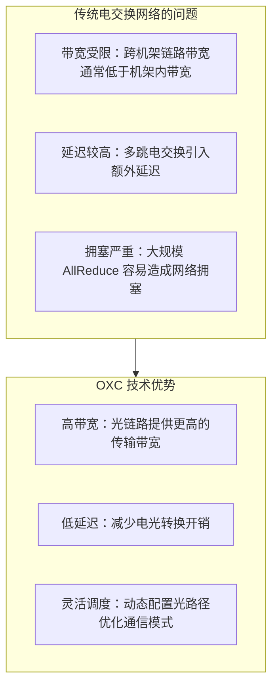

### 1.3 设计目标

| 目标 | 描述 |
|------|------|
| **无缝集成** | 将 OXC 算法集成到 SimAI 仿真框架中 |
| **灵活配置** | 支持外部 RankTable 配置，适应不同拓扑 |
| **混合策略** | OXC 处理跨机架通信，原生算法处理机架内通信 |
| **可扩展性** | 支持大规模 GPU 集群仿真 |

---

## 2. 训练流程与通信模式

### 2.1 训练流程概述

大模型训练的一个迭代包含三个主要阶段：

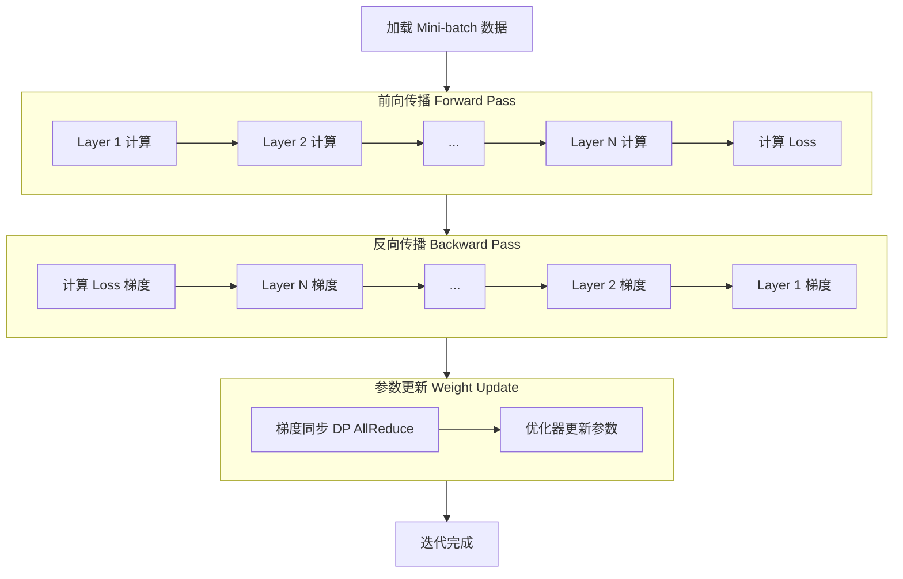

### 2.2 并行策略与通信阶段

#### 2.2.1 TP (Tensor Parallelism) - 张量并行

TP 将单层的参数切分到多个 GPU，发生在每一层的前向和反向传播中。

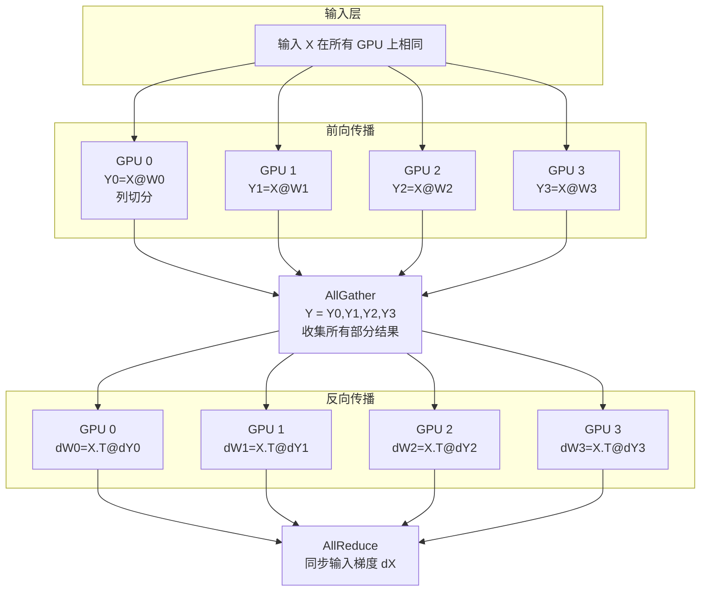

#### 2.2.2 DP (Data Parallelism) - 数据并行

DP 每个 GPU 有完整模型副本，处理不同数据，发生在反向传播结束后。

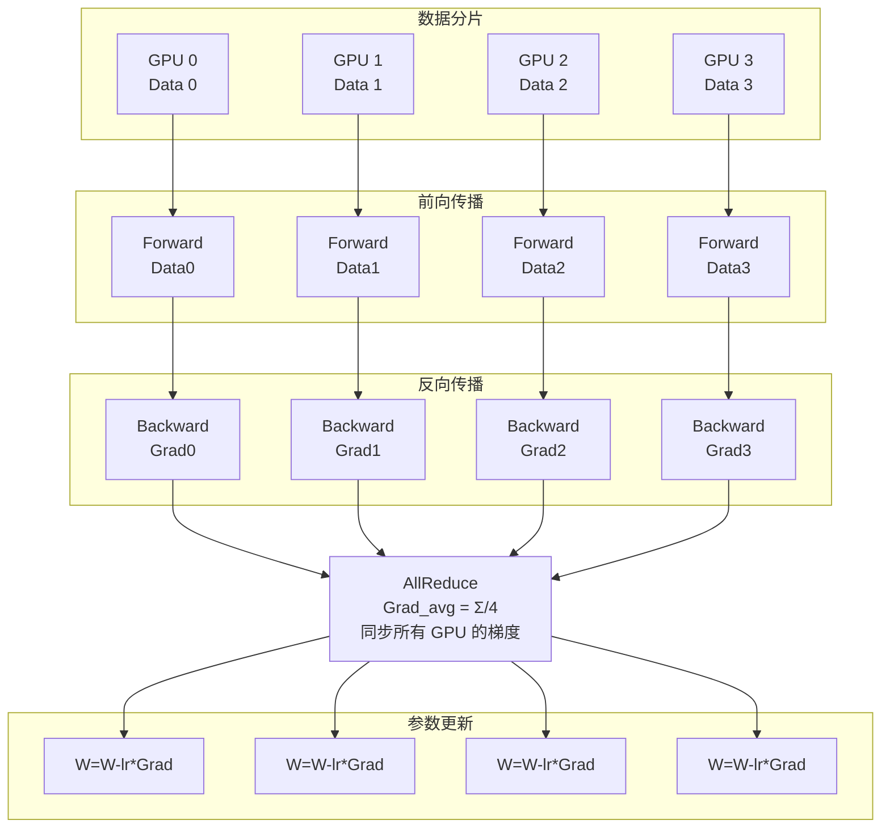

#### 2.2.3 PP (Pipeline Parallelism) - 流水线并行

PP 将模型按层切分到不同 GPU，发生在层与层之间的数据传递。

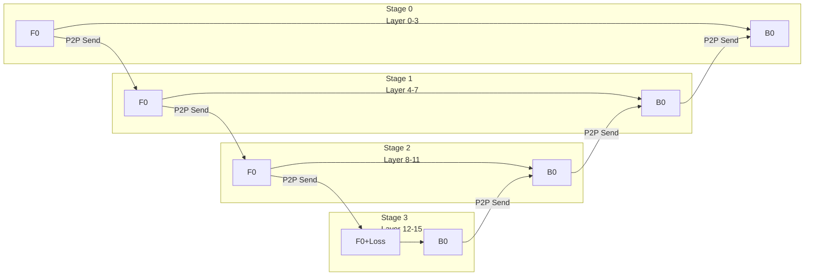

**说明**: PP 使用 P2P Send/Recv，不使用集合通信。上图展示 1F1B 调度中 Micro-batch 0 的前向和反向传播流程。

#### 2.2.4 EP (Expert Parallelism) - 专家并行

EP 用于 MoE (Mixture of Experts) 模型，发生在 MoE 层的 token 路由。

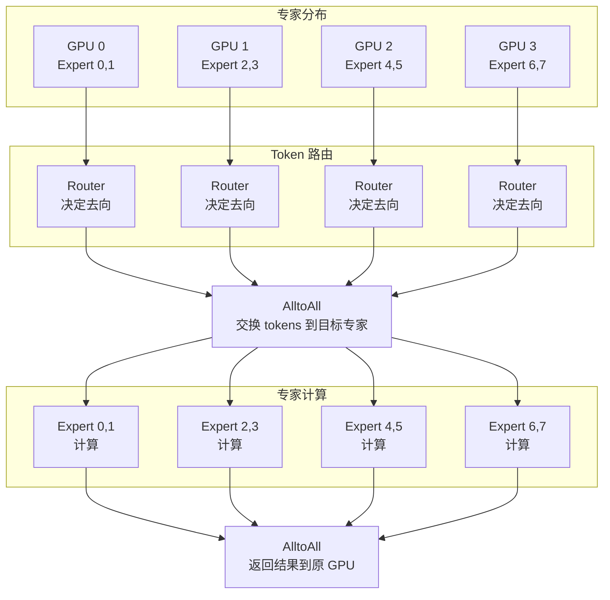

### 2.3 通信动作总结

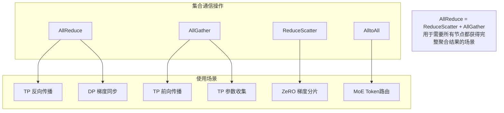

### 2.4 通信动作发生阶段总结表

| 通信动作 | 并行策略 | 发生阶段 | 通信组 | 是否跨机架 |
|----------|----------|----------|--------|------------|
| AllReduce | TP | 前向/反向每层 | TP 组 | 通常机架内 |
| AllReduce | DP | 反向传播后 | DP 组 | **跨机架** |
| AllGather | TP | 前向传播 | TP 组 | 通常机架内 |
| ReduceScatter | TP/ZeRO | 反向传播 | TP/DP 组 | 视情况 |
| AlltoAll | EP | MoE 层前后 | EP 组 | 视情况 |
| P2P Send/Recv | PP | 层间传递 | 相邻 Stage | 视情况 |

**关键结论**：

- **TP 通信**：发生在每层，但通常在机架内（同一服务器的 GPU）
- **DP 通信**：发生在反向传播后，通常跨机架 → **OXC 优化目标**
- **PP 通信**：使用 P2P，不使用集合通信
- **EP 通信**：使用 AlltoAll，在 MoE 层

---

## 3. 系统架构

### 3.1 整体架构图

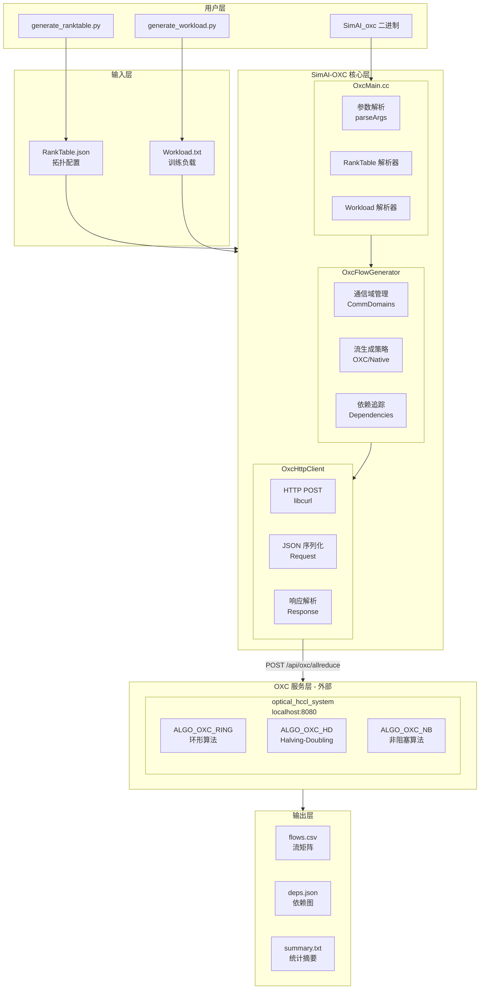

### 3.2 模块职责

| 模块 | 职责 | 关键文件 |
|------|------|----------|
| **OxcMain** | 程序入口、参数解析、流程编排 | `OxcMain.cc` |
| **OxcFlowGenerator** | 流生成核心逻辑、通信域管理 | `OxcFlowGenerator.h/cc` |
| **OxcHttpClient** | HTTP 通信、JSON 序列化 | `OxcHttpClient.h/cc` |
| **OxcFlowOutput** | 结果输出、格式化 | `OxcFlowOutput.h/cc` |
| **OxcTypes** | 共享数据结构定义 | `OxcTypes.h` |

### 3.3 文件结构

```
astra-sim-alibabacloud/
├── astra-sim/
│   ├── network_frontend/
│   │   └── oxc/                    # OXC 前端模块
│   │       ├── CMakeLists.txt      # 编译配置
│   │       ├── OxcMain.cc          # 主入口
│   │       ├── OxcFlowGenerator.h  # 流生成器头文件
│   │       ├── OxcFlowGenerator.cc # 流生成器实现
│   │       ├── OxcHttpClient.h     # HTTP 客户端头文件
│   │       ├── OxcHttpClient.cc    # HTTP 客户端实现
│   │       ├── OxcFlowOutput.h     # 输出模块头文件
│   │       └── OxcFlowOutput.cc    # 输出模块实现
│   └── system/
│       └── OxcTypes.h              # 共享数据结构
├── build/
│   └── simai_oxc/                  # OXC 编译目录
│       ├── build.sh                # 编译脚本
│       └── CMakeLists.txt          # CMake 配置
└── ...

aicb/scripts/
├── generate_ranktable.py           # RankTable 生成脚本
└── generate_dp_allreduce_workload.py # DP AllReduce 工作负载生成
```

---

## 4. 核心数据结构

### 4.1 RankTable 结构

RankTable 是描述 GPU 集群拓扑的核心配置，定义在 `OxcTypes.h` 中：

```cpp
// 网络地址信息
struct RankAddr {
    std::string addr_type;           // 地址类型，如 "EID"
    std::string addr;                // 地址值，如 "000000000000002000100000df001001"
    std::vector<std::string> ports;  // 端口列表，如 ["0/0"]
    std::string plane_id;            // 平面ID，如 "plane0"
};

// 网络层级信息
struct LevelInfo {
    int net_layer;                   // 网络层级，0 表示机架级
    std::string net_instance_id;     // 网络实例ID，如 "rack_0"
    std::string net_type;            // 网络类型，如 "TOPO_FILE_DESC"
    std::string net_attr;            // 网络属性
    std::vector<RankAddr> rank_addr_list;  // 地址列表
};

// 单个 Rank 的信息
struct RankInfo {
    int rank_id;                     // 全局 Rank ID
    int device_id;                   // 设备 ID
    int local_id;                    // 本地 ID（服务器内）
    std::vector<LevelInfo> level_list;  // 网络层级列表
};

// 完整的 RankTable
struct RankTable {
    std::string version = "2.0";     // 版本号
    std::string status = "completed"; // 状态
    int rank_count;                  // Rank 总数
    std::vector<RankInfo> rank_list; // Rank 列表
};
```

### 4.2 RankTable JSON 示例

```json
{
  "version": "2.0",
  "status": "completed",
  "rank_count": 16,
  "rank_list": [
    {
      "rank_id": 0,
      "device_id": 0,
      "local_id": 0,
      "level_list": [
        {
          "net_layer": 0,
          "net_instance_id": "rack_0",
          "net_type": "TOPO_FILE_DESC",
          "net_attr": "",
          "rank_addr_list": [
            {
              "addr_type": "EID",
              "addr": "000000000000002000100000df001001",
              "ports": ["0/0"],
              "plane_id": "plane0"
            }
          ]
        }
      ]
    }
  ]
}
```

### 4.3 OXC API 请求结构

```cpp
struct OxcAllReduceRequest {
    RankTable ranktable;                              // 集群拓扑
    std::vector<std::vector<int>> dpCommDomain;       // DP 通信域
    double commDomainVolume;                          // 通信数据量（字节）
    std::map<std::string, std::string> rankIdRackIdMap;  // Rank 到 Rack 映射
    std::string algName;                              // 算法名称
};
```

**算法选项**：
| 算法名称 | 描述 |
|----------|------|
| `ALGO_OXC_RING` | 基于环形拓扑的 AllReduce |
| `ALGO_OXC_HD` | Halving-Doubling 算法 |
| `ALGO_OXC_NB` | 非阻塞算法 |

### 4.4 OXC API 响应结构

```cpp
// OXC 服务返回的流条目
struct OxcFlowEntry {
    int src_rank;      // 源 Rank
    int dst_rank;      // 目标 Rank
    int step;          // 步骤编号
    uint64_t datasize; // 数据大小（字节）
};
```

**响应 JSON 格式**：
```json
[
  [0, 8, 0, 16777216],
  [8, 0, 0, 16777216],
  [1, 9, 0, 16777216],
  ...
]
```

### 4.5 输出流结构

```cpp
struct OutputFlow {
    int operation_id;           // 操作 ID
    std::string layer_name;     // 层名称
    std::string comm_type;      // 通信类型
    std::string group_type;     // 组类型（DP/TP/EP/PP）
    int flow_id;                // 流 ID
    int src;                    // 源 Rank
    int dst;                    // 目标 Rank
    uint64_t flow_size;         // 流大小
    int step;                   // 步骤
    std::vector<int> depends_on; // 依赖的流 ID 列表
};
```

### 4.6 操作上下文

```cpp
struct OperationContext {
    int operation_id;           // 操作 ID
    std::string layer_name;     // 层名称
    std::string phase;          // 阶段（fwd/bwd/wg）
    CommType comm_type;         // 通信类型
    GroupType group_type;       // 组类型
    uint64_t msg_size;          // 消息大小
    std::vector<int> comm_group; // 通信组成员
};
```

### 4.7 通信类型枚举

```cpp
enum class CommType {
    ALLREDUCE,
    ALLGATHER,
    REDUCESCATTER,
    ALLTOALL,
    BROADCAST,
    REDUCE,
    P2P_SEND,
    P2P_RECV
};

enum class GroupType {
    TP,   // Tensor Parallelism
    DP,   // Data Parallelism
    EP,   // Expert Parallelism
    PP    // Pipeline Parallelism
};
```

---

## 5. 模块设计

### 5.1 OxcMain 模块

**职责**：程序入口、参数解析、流程编排

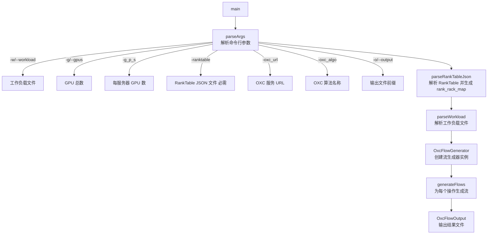

**关键函数**：

```cpp
// 解析 RankTable JSON 文件
bool parseRankTableJson(
    const std::string& filepath,
    RankTable& ranktable,
    std::map<std::string, std::string>& rank_rack_map
);

// rank_rack_map 自动生成逻辑
for (const auto& rank : ranktable.rank_list) {
    if (!rank.level_list.empty()) {
        // 使用第一个 level 的 net_instance_id 作为 rack_id
        rank_rack_map[to_string(rank.rank_id)] = rank.level_list[0].net_instance_id;
    }
}
```

### 5.2 OxcFlowGenerator 模块

**职责**：核心流生成逻辑、通信域管理、OXC/Native 策略选择

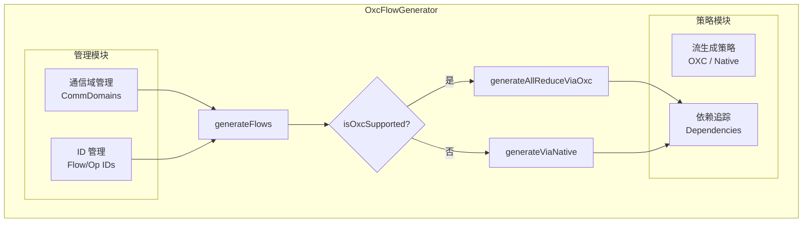

**OXC 支持判断**：

```cpp
bool OxcFlowGenerator::isOxcSupported(CommType comm_type) const {
    // 目前仅 DP AllReduce 使用 OXC
    return comm_type == CommType::ALLREDUCE;
}
```

**通信域构建**：

```cpp
// 示例：TP=8, DP=2, 总共 16 GPU
// DP 通信域: [[0,8], [1,9], [2,10], [3,11], [4,12], [5,13], [6,14], [7,15]]
// 每个域内的 rank 需要一起做 AllReduce

std::vector<std::vector<int>> buildCommDomains(GroupType group_type, int total_gpus) {
    std::vector<std::vector<int>> domains;

    if (group_type == GroupType::DP) {
        // DP 域：相同 TP 位置的 rank 组成一个域
        for (int tp_idx = 0; tp_idx < tp_size_; tp_idx++) {
            std::vector<int> domain;
            for (int dp_idx = 0; dp_idx < dp_size_; dp_idx++) {
                domain.push_back(tp_idx + dp_idx * tp_size_);
            }
            domains.push_back(domain);
        }
    }
    return domains;
}
```

### 5.3 OxcHttpClient 模块

**职责**：HTTP 通信、JSON 序列化/反序列化

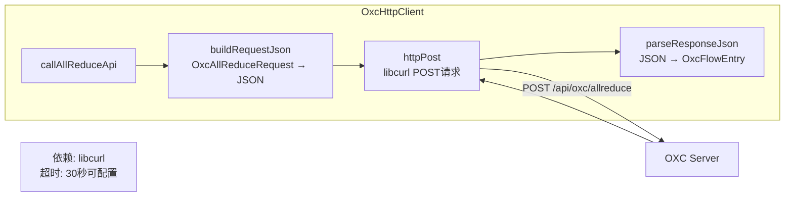

### 5.4 OxcFlowOutput 模块

**职责**：结果输出、格式化

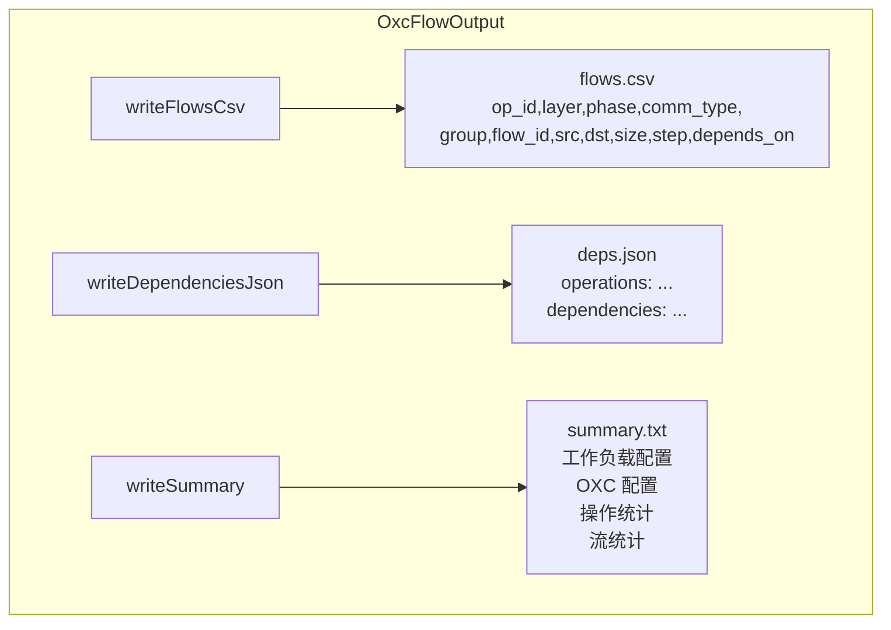

---

## 6. 流程设计

### 6.1 整体执行流程

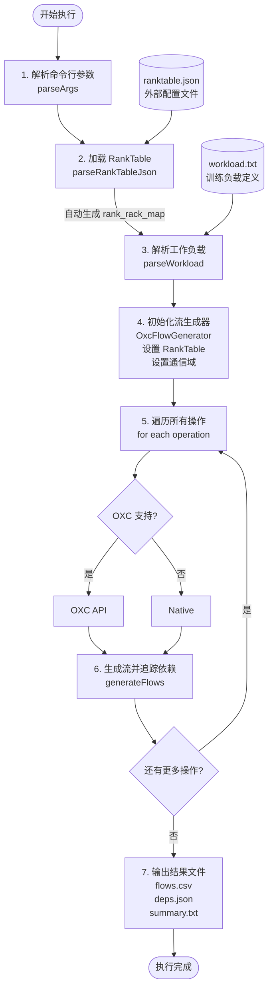

### 6.2 OXC API 调用流程

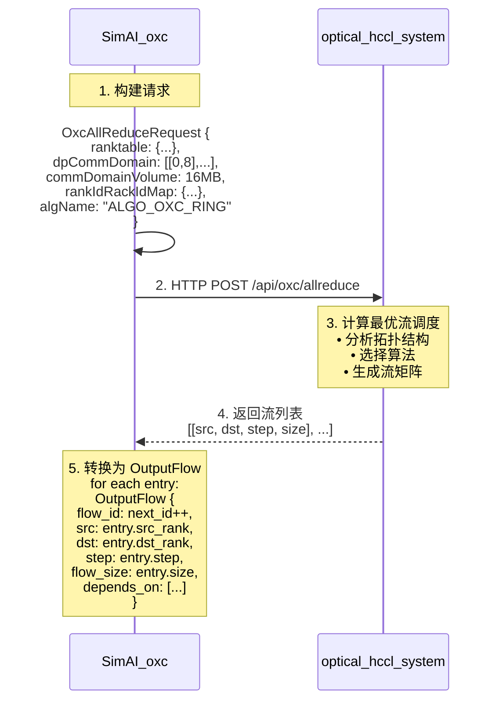

### 6.3 依赖追踪机制

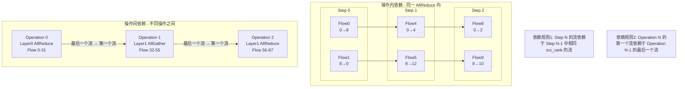

### 6.4 Native 流生成（非 OXC 操作）

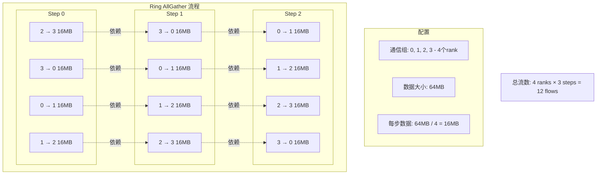

---

## 7. 接口规范

### 7.1 命令行接口

```bash
./bin/SimAI_oxc [选项]
```

| 参数 | 简写 | 必需 | 默认值 | 描述 |
|------|------|------|--------|------|
| `--workload` | `-w` | 是 | - | 工作负载文件路径 |
| `--gpus` | `-g` | 是 | - | GPU 总数 |
| `--gpus-per-server` | `-g_p_s` | 否 | 8 | 每服务器 GPU 数 |
| `--ranktable` | - | 是 | - | RankTable JSON 文件路径 |
| `--oxc-url` | - | 否 | http://localhost:8080 | OXC 服务 URL |
| `--oxc-algo` | - | 否 | ALGO_OXC_RING | OXC 算法名称 |
| `--output` | `-o` | 否 | ./results/oxc | 输出文件前缀 |
| `--tp-size` | - | 否 | 8 | Tensor Parallelism 大小 |
| `--dp-size` | - | 否 | 自动计算 | Data Parallelism 大小 |
| `--ep-size` | - | 否 | 1 | Expert Parallelism 大小 |
| `--pp-size` | - | 否 | 1 | Pipeline Parallelism 大小 |

### 7.2 OXC HTTP API

#### 7.2.1 AllReduce 端点

**请求**：
```
POST /api/oxc/allreduce
Content-Type: application/json
```

**请求体**：
```json
{
  "ranktable": {
    "version": "2.0",
    "status": "completed",
    "rank_count": 16,
    "rank_list": [...]
  },
  "dpCommDomain": [[0, 8], [1, 9], ...],
  "commDomainVolume": 16777216,
  "rankIdRackIdMap": {
    "0": "rack_0",
    "1": "rack_0",
    "8": "rack_1",
    "9": "rack_1"
  },
  "algName": "ALGO_OXC_RING"
}
```

**响应**：
```json
[
  [0, 8, 0, 16777216],
  [8, 0, 0, 16777216],
  [1, 9, 0, 16777216],
  [9, 1, 0, 16777216],
  ...
]
```

**响应字段说明**：
| 索引 | 字段 | 类型 | 描述 |
|------|------|------|------|
| 0 | src_rank | int | 源 Rank ID |
| 1 | dst_rank | int | 目标 Rank ID |
| 2 | step | int | 步骤编号（从 0 开始） |
| 3 | datasize | int64 | 数据大小（字节） |

### 7.3 输出文件格式

#### 7.3.1 流矩阵 CSV (`*_flows.csv`)

```csv
op_id,layer,phase,comm_type,group,flow_id,src,dst,size,step,depends_on
0,embedding,fwd,ALLREDUCE,DP,0,0,8,16777216,0,[]
0,embedding,fwd,ALLREDUCE,DP,1,8,0,16777216,0,[]
0,embedding,fwd,ALLREDUCE,DP,2,1,9,16777216,0,[]
0,embedding,fwd,ALLREDUCE,DP,3,9,1,16777216,0,[]
0,embedding,fwd,ALLREDUCE,DP,4,0,4,16777216,1,[0]
0,embedding,fwd,ALLREDUCE,DP,5,8,12,16777216,1,[1]
```

**字段说明**：
| 字段 | 类型 | 描述 |
|------|------|------|
| op_id | int | 操作 ID |
| layer | string | 层名称 |
| phase | string | 阶段（fwd/bwd/wg） |
| comm_type | string | 通信类型 |
| group | string | 组类型（DP/TP/EP/PP） |
| flow_id | int | 全局流 ID |
| src | int | 源 Rank |
| dst | int | 目标 Rank |
| size | int64 | 数据大小（字节） |
| step | int | 步骤编号 |
| depends_on | list | 依赖的流 ID 列表 |

#### 7.3.2 依赖图 JSON (`*_deps.json`)

```json
{
  "operations": [
    {
      "op_id": 0,
      "layer": "embedding",
      "phase": "fwd",
      "comm_type": "ALLREDUCE",
      "group_type": "DP",
      "flow_count": 32,
      "first_flow_id": 0,
      "last_flow_id": 31
    },
    {
      "op_id": 1,
      "layer": "attention",
      "phase": "fwd",
      "comm_type": "ALLGATHER",
      "group_type": "TP",
      "flow_count": 24,
      "first_flow_id": 32,
      "last_flow_id": 55
    }
  ],
  "operation_dependencies": {
    "1": [0],
    "2": [1]
  },
  "flow_dependencies": {
    "4": [0],
    "5": [1],
    "32": [31]
  }
}
```

#### 7.3.3 摘要文件 (`*_summary.txt`)

```
SimAI-OXC Flow Generation Summary
=================================

Workload Configuration:
  Parallelism Policy: HYBRID_TRANSFORMER_FWD_IN_BCKWD
  Total GPUs: 16
  GPUs per Server: 8
  TP Size: 8
  EP Size: 1
  PP Size: 1

OXC Configuration:
  Server URL: http://localhost:8080
  Algorithm: ALGO_OXC_RING

Operations Processed:
  Total Operations: 6168
  - ALLREDUCE: 24 (OXC)
  - ALLGATHER: 4096 (Native)
  - REDUCESCATTER: 2048 (Native)

Flow Statistics:
  Total Flows Generated: 345888
  Total Dependencies: 296592

Output Files:
  Flow Matrix: results/oxc_test_flows.csv
  Dependency Graph: results/oxc_test_deps.json
  Summary: results/oxc_test_summary.txt
```

### 7.4 RankTable 生成脚本接口

```bash
python3 aicb/scripts/generate_ranktable.py [选项]
```

| 参数 | 必需 | 默认值 | 描述 |
|------|------|--------|------|
| `--num-gpus` | 是 | - | GPU 总数 |
| `--gpus-per-server` | 否 | 8 | 每服务器 GPU 数 |
| `--output` | 否 | ranktable.json | 输出文件路径 |
| `--addr-prefix` | 否 | 00000000000000200010 | 地址前缀 |

**示例**：
```bash
# 生成 16 GPU 的 RankTable
python3 aicb/scripts/generate_ranktable.py \
    --num-gpus 16 \
    --gpus-per-server 8 \
    --output ./config/ranktable_16gpu.json
```

---

## 8. 使用指南

### 8.1 环境准备

#### 8.1.1 依赖安装

```bash
# Ubuntu/Debian
sudo apt-get update
sudo apt-get install -y build-essential cmake libcurl4-openssl-dev

# CentOS/RHEL
sudo yum install -y gcc gcc-c++ cmake libcurl-devel
```

#### 8.1.2 启动 OXC 服务

```bash
# 确保 optical_hccl_system 服务已启动
cd /path/to/optical_hccl_system
java -jar optical_hccl_system.jar

# 验证服务状态
curl http://localhost:8080/health
```

### 8.2 编译

```bash
# 进入 SimAI 目录
cd /path/to/SimAI

# 编译 OXC 模块
./scripts/build.sh -c oxc

# 验证编译结果
ls -la ./bin/SimAI_oxc
```

### 8.3 配置文件准备

#### 8.3.1 生成 RankTable

```bash
# 生成 16 GPU（2 服务器 × 8 GPU）的 RankTable
python3 aicb/scripts/generate_ranktable.py \
    --num-gpus 16 \
    --gpus-per-server 8 \
    --output ./config/ranktable.json

# 生成 128 GPU 的 RankTable
python3 aicb/scripts/generate_ranktable.py \
    --num-gpus 128 \
    --gpus-per-server 8 \
    --output ./config/ranktable_128gpu.json
```

#### 8.3.2 准备工作负载文件

使用 AICB 生成工作负载：

```bash
# 生成 Megatron 风格的工作负载
python3 aicb/workload_generator/generate_megatron_workload.py \
    --model-size 7B \
    --tp 8 \
    --dp 2 \
    --output ./workloads/megatron_7b.txt
```

或使用示例工作负载：

```bash
# 使用内置示例
cp ./example/workload_analytical.txt ./workloads/
```

### 8.4 运行仿真

#### 8.4.1 基本运行

```bash
./bin/SimAI_oxc \
    -w ./workloads/megatron_7b.txt \
    -g 16 \
    -g_p_s 8 \
    -ranktable ./config/ranktable.json \
    -oxc_url http://localhost:8080 \
    -oxc_algo ALGO_OXC_RING \
    -o ./results/oxc_test
```

#### 8.4.2 使用不同算法

```bash
# 使用 Halving-Doubling 算法
./bin/SimAI_oxc \
    -w ./workloads/megatron_7b.txt \
    -g 16 \
    -g_p_s 8 \
    -ranktable ./config/ranktable.json \
    -oxc_algo ALGO_OXC_HD \
    -o ./results/oxc_hd

# 使用非阻塞算法
./bin/SimAI_oxc \
    -w ./workloads/megatron_7b.txt \
    -g 16 \
    -g_p_s 8 \
    -ranktable ./config/ranktable.json \
    -oxc_algo ALGO_OXC_NB \
    -o ./results/oxc_nb
```

#### 8.4.3 大规模仿真

```bash
# 128 GPU 仿真
./bin/SimAI_oxc \
    -w ./workloads/large_model.txt \
    -g 128 \
    -g_p_s 8 \
    -ranktable ./config/ranktable_128gpu.json \
    -oxc_url http://localhost:8080 \
    -oxc_algo ALGO_OXC_RING \
    -o ./results/oxc_128gpu
```

### 8.5 结果分析

#### 8.5.1 查看摘要

```bash
cat ./results/oxc_test_summary.txt
```

#### 8.5.2 分析流矩阵

```bash
# 查看前 20 行
head -20 ./results/oxc_test_flows.csv

# 统计各类型操作数量
awk -F',' 'NR>1 {print $4}' ./results/oxc_test_flows.csv | sort | uniq -c
```

#### 8.5.3 可视化依赖图

```python
import json
import matplotlib.pyplot as plt
import networkx as nx

# 加载依赖图
with open('./results/oxc_test_deps.json', 'r') as f:
    deps = json.load(f)

# 创建有向图
G = nx.DiGraph()
for op in deps['operations']:
    G.add_node(op['op_id'], label=f"{op['layer']}\n{op['comm_type']}")

for op_id, dep_list in deps['operation_dependencies'].items():
    for dep in dep_list:
        G.add_edge(dep, int(op_id))

# 绘制
plt.figure(figsize=(12, 8))
pos = nx.spring_layout(G)
nx.draw(G, pos, with_labels=True, node_color='lightblue',
        node_size=500, font_size=8, arrows=True)
plt.savefig('./results/dependency_graph.png')
```

### 8.6 故障排除

#### 8.6.1 常见问题

| 问题 | 可能原因 | 解决方案 |
|------|----------|----------|
| OXC API 连接失败 | 服务未启动 | 检查 `curl http://localhost:8080/health` |
| RankTable 解析错误 | JSON 格式错误 | 使用 `python -m json.tool ranktable.json` 验证 |
| 流数量为 0 | 工作负载无 AllReduce | 检查工作负载文件内容 |
| 编译失败 | 缺少 libcurl | 安装 `libcurl4-openssl-dev` |

#### 8.6.2 调试模式

```bash
# 启用详细日志
AS_LOG_LEVEL=DEBUG ./bin/SimAI_oxc \
    -w ./workloads/test.txt \
    -g 16 \
    -g_p_s 8 \
    -ranktable ./config/ranktable.json \
    -o ./results/debug_test
```

#### 8.6.3 验证 OXC 服务

```bash
# 手动测试 OXC API
curl -X POST http://localhost:8080/api/oxc/allreduce \
    -H "Content-Type: application/json" \
    -d '{
        "ranktable": {"version": "2.0", "status": "completed", "rank_count": 2, "rank_list": []},
        "dpCommDomain": [[0, 1]],
        "commDomainVolume": 1048576,
        "rankIdRackIdMap": {"0": "rack_0", "1": "rack_1"},
        "algName": "ALGO_OXC_RING"
    }'
```

---

## 附录

### A. 术语表

| 术语 | 全称 | 描述 |
|------|------|------|
| OXC | Optical Cross-Connect | 光交叉连接，用于光网络中的信号交换 |
| TP | Tensor Parallelism | 张量并行，将单层参数切分到多个 GPU |
| DP | Data Parallelism | 数据并行，每个 GPU 处理不同数据批次 |
| EP | Expert Parallelism | 专家并行，用于 MoE 模型 |
| PP | Pipeline Parallelism | 流水线并行，将模型按层切分 |
| AllReduce | - | 集合通信操作，聚合所有节点数据 |
| AllGather | - | 集合通信操作，收集所有节点数据 |
| ReduceScatter | - | 集合通信操作，聚合并分发数据 |

### B. 参考资料

1. SimAI 论文：[NSDI'25 Spring - SimAI](https://ennanzhai.github.io/pub/nsdi25spring-simai.pdf)
2. AICB 文档：https://github.com/aliyun/aicb
3. optical_hccl_system 文档：内部文档
4. NCCL 算法：https://docs.nvidia.com/deeplearning/nccl/

### C. 版本历史

| 版本 | 日期 | 描述 |
|------|------|------|
| 1.0 | 2024-01 | 初始版本，支持 OXC AllReduce |
| 1.1 | 2024-02 | 添加外部 RankTable 支持 |